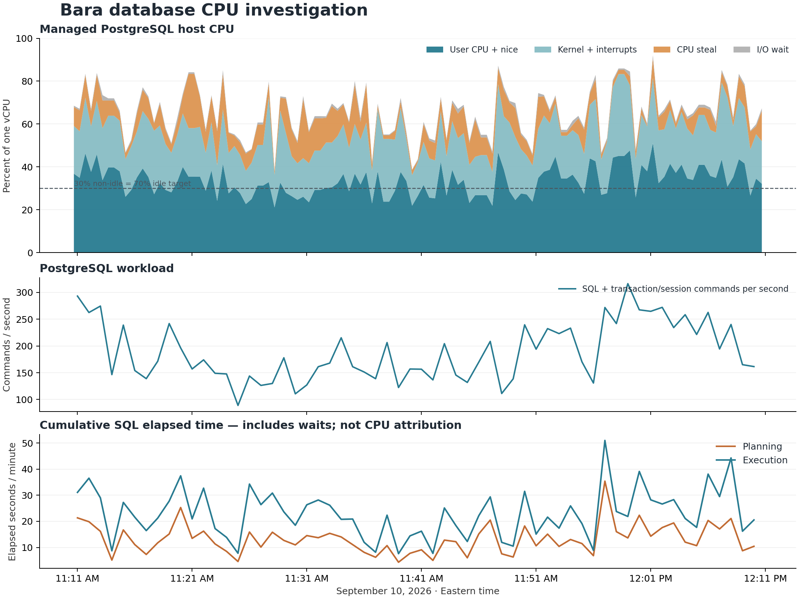

# Database CPU investigation — September 10, 2026

The hour shows a sustained mix of frequent application SQL, repeated query planning, background resolution/publication and notification work, and avoidable retained-capture maintenance. CPU steal adds a separate host-capacity cost. There is no evidence in the samples of one continuously running query or a sustained lock pileup explaining the hour.

Direct managed-database non-idle CPU averaged **65.3%**, ranging from **38.4% to 92.1%**. Average idle was **34.7%**, below the previously stated 70% idle target. These are sample averages, not a matched-traffic before/after benchmark.

## Scope and evidence

- Managed cluster: `stock-sentiment`, `db-s-1vcpu-2gb`, PostgreSQL 18.6. These are the database host metrics, not the application Droplet's CPU.
- Runtime commit verified at the start: `3a60332e17dac7f843f107fb788e8479875104ef`. End-of-watch verification is retained with the investigation evidence.
- CPU: 121 samples at approximately 30-second intervals; `2026-09-10T15:10:41.244746+00:00` through `2026-09-10T16:10:41.182688+00:00`. Approximately 11:10–12:10 Eastern.
- `pg_stat_statements`: 61 snapshots, `2026-09-10T15:10:39.667Z` through `2026-09-10T16:10:39.482Z`; 3599.8 seconds.
- `pg_stat_monitor`: 60 completed, distinct minute buckets, starting `2026-09-10T15:11:00.000Z` through the end of the bucket starting `2026-09-10T16:10:00.000Z`. Approximately 11:11–12:11 Eastern. This is a slightly shifted hour so every bucket is complete.
- `pg_stat_activity`: 360 ten-second samples. Table counters: `2026-09-10T15:12:32.116Z` through `2026-09-10T16:11:00.339Z`; their window is slightly shorter/different from the CPU hour.
- All SQL diagnostics used explicit read-only transactions with five-second local statement timeouts. One bounded SELECT execution plan was measured. No application-row mutation, cancellation of application queries, deployment, application restart, scaling change, or configuration change was performed. Staging stayed stopped; two HTTP workers were retained.

[Minute-by-minute comparison CSV](evidence/db-cpu-hour-20260910/minute-comparison.csv) · [Measurements](evidence/db-cpu-hour-20260910/measurements.json) · [Collection verification](evidence/db-cpu-hour-20260910/verification.json)

## What the host was doing

| Metric | Average | Minimum | Maximum |
| --- | ---: | ---: | ---: |
| Non-idle CPU | 65.27% | 38.37% | 92.06% |
| User CPU | 33.32% | 21.10% | 51.10% |
| Nice CPU | 0.01% | 0.00% | 1.76% |
| System CPU | 19.12% | 12.14% | 37.76% |
| IRQ | 1.60% | 1.03% | 2.50% |
| Soft IRQ | 2.18% | 1.09% | 3.46% |
| CPU steal | 8.06% | 0.50% | 27.53% |
| I/O wait | 0.97% | 0.16% | 2.51% |
| PgBouncer process CPU, already included above | 3.78% | 1.62% | 6.56% |

First-half non-idle CPU averaged 64.2%; second-half averaged 66.4%. The graph preserves the spikes and quieter periods.

CPU steal is time the virtual CPU cannot obtain physical CPU service; it is not query execution. The average above is a real additional capacity limitation. [Linux CPU accounting](https://www.kernel.org/doc/html/latest/filesystems/proc.html).

Available RAM ranged from 234 to 457 MiB. Swap used at the end was 769 MiB. The `zram0` device received 1496 MiB of writes and 1307 MiB of reads during the CPU window. This demonstrates active compressed-memory I/O, beyond simply having cold pages stored in swap. Compression/decompression is a plausible additional CPU cost, but its exact CPU share was not measured. Low I/O wait therefore does not establish that memory management is free. [Linux zram documentation](https://cdn.kernel.org/doc/html/latest/admin-guide/blockdev/zram.html).

## SQL volume and background amplification

Completed `pg_stat_monitor` buckets contain **679,716 commands (188.8/second)**. Of these, **220,841** are utility commands, predominantly SET, BEGIN and COMMIT; approximately **458,875 (127.5/second)** are other statements. Diagnostics are included and quantified below.

Over the corresponding HTTP telemetry window there were **22,242 HTTP requests**, including **2,010 step-intake requests**, and 2,782 committed race-resolution attempts. These are whole-workload totals: dividing all SQL by step-sync requests would incorrectly charge other HTTP requests and background jobs to each individual sync.

| Process role | Commands | Planning elapsed | Execution elapsed |
| --- | ---: | ---: | ---: |
| HTTP workers | 248,434 | 332.9 s | 486.7 s |
| Resolution worker | 315,009 | 374.2 s | 552.5 s |
| Cron worker | 112,716 | 86.2 s | 266.2 s |
| This investigation | 3,525 | 1.3 s | 63.6 s |

Recorded planning totals **794.7 seconds** and execution totals **1,369.2 seconds**. Both are cumulative elapsed times across sessions; they must not be divided by the hour and labeled exact CPU percentages.

Bara's database counters increased by 33,608 inserted, 147,686 updated and 7,918 deleted tuples. Its measured buffer-hit ratio was 98.85%. Other application databases showed no application-row writes in their counters. The provider's `_dodb` database had management transactions, so managed-service overhead is not assumed to be zero.

## Strongest optimization targets

### 1. Repeated planning of the race display-boundary lookup

Query ID `-2382482178559971389` ran **2,648 times**, accumulating **135.3 seconds planning** and **25.0 seconds execution**. That is 51.1 ms of recorded planning per call on average, and 17.0% of recorded planning time.

[The query](../src/modules/races/services/raceDisplayBoundaryProof.js) finds the next event/entitlement boundary when [a worker publishes a race snapshot](../src/modules/races/services/raceProgressSideEffects.js). It is not annotated for the existing bounded named-prepared-query path. A single read-only EXPLAIN ANALYZE measured **48.102 ms planning and 12.508 ms execution**, using existing participant and entitlement indexes. Its two entitlement branches each traversed 31 participants in that example. This is evidence for reducing repeated planning and repeated traversal, not evidence that a new index alone will solve the problem.

The first candidate is to use the existing [bounded prepared-query support](../src/shared/database/preparedReadQueries.js) for this stable parameterized read and test plan reuse through PgBouncer. Preserve boundary freshness and generation checks. The recorded planning time is an opportunity size in elapsed time, not a promised CPU saving.

Other recurrent planning costs include post-task completion, post-task lag/expiry statistics, active-event reads, and race-discovery reads. The larger opportunity is reducing repeated planning across these frequent paths, not assuming one prepared query fixes total CPU.

### 2. Retained capture cleanup repeatedly writes records it keeps

Over the table-counter window, `durable_capture_fact_roots` had **37,579 updates, 0 inserts and 0 deletes**. An earlier bounded inventory counted 6,763 roots, of which 6,454 were pinned; none were evicting or retention-expired at that instant.

The live `durable_capture_evict_roots` implementation revisits roots whose `last_used_at` is older than ten minutes and writes `last_used_at=now()` even when pins or retention prevent eviction. See [the eviction function](../prisma/migrations/20260905013000_durable_capture_bounded_eviction/migration.sql), [compaction scheduling](../prisma/migrations/20260906010000_capture_compaction_schedule/migration.sql), and [the cleanup caller](../src/modules/steps/services/durableCaptureCleanup.js). These updates create WAL, dead tuples and maintenance work while preserving the same retained records.

Prefer an eligibility-aware revisit schedule and prompt reactions to pin release/version changes, with bounded cleanup. Preserve historical-input durability and capture correctness. Row-update count does not establish an exact CPU share.

### 3. Frequent race reads, queue/publication work and notification bookkeeping

The following groups describe SQL text families; they are not measured CPU percentages. Some legitimate concurrency checks intentionally read inputs more than once, so optimization must preserve the input fences.

| Workload family | Commands | Planning elapsed | Execution elapsed |
| --- | ---: | ---: | ---: |
| Race input fingerprints | 19,764 | 3.6 s | 143.6 s |
| Batched step-sample reads | 2,539 | 0.1 s | 60.4 s |
| Resolution queue and publication | 85,974 | 120.5 s | 137.7 s |
| Notifications and outbox | 46,425 | 58.2 s | 233.2 s |
| Capture-history compaction | 966 | 10.2 s | 50.7 s |
| Other race queries | 110,413 | 264.5 s | 240.1 s |
| Operational counter writes | 11,228 | 1.4 s | 2.7 s |

The [race fingerprint builder](../src/modules/races/services/raceResolutionInputFingerprint.js) performs four protected input reads. [Resolution](../src/modules/races/jobs/raceResolutionQueueV2.js) uses fingerprints for planning and pre-write validation; these correctness checks cannot simply be removed. Retain the fences while reducing repeated loading, avoiding unnecessary jobs and reusing version-valid results.

Notification/outbox work adds inserts, claims, receipts and status updates downstream of user activity. Prioritize the measured high-cost families rather than treating a queue as a reduction in total database work. Operational counter writes are a smaller optimization opportunity: [the recorder](../src/modules/steps/services/globalStepEventObservability.js) performs one upsert per nonzero metric; batching can reduce round trips, but these counters are not the largest measured SQL-time cost.

## Activity, monitoring cost and limits

- Sampled active client waits: `{'no reported wait': 246, 'IO': 48, 'Client': 4, 'Lock': 8, 'LWLock': 3}`. Maximum observed active client query age was 3.725 seconds. Ten-second sampling can miss short waits/spikes and is not a complete wait-time profile. Observed deadlocks in the database-counter delta: 0.
- `44` activity observations included autovacuum. This establishes maintenance activity, not its CPU share.
- Diagnostics account for 63.6 seconds of recorded execution and 1.3 seconds of planning in the completed buckets. Their reported executor user+system CPU is 17.6 seconds; this is not the total overhead of every monitoring hook. The additional bucket collector was narrowed during the watch to request only unseen completed buckets.
- One additional-statistics SELECT hit the five-second read-only timeout and was rolled back. A later read recovered the retained buckets. Final bucket continuity is verified separately.
- HTTP telemetry sometimes labels a minute one minute early when its timer fires milliseconds before the boundary. The comparison aligns records using the nearest minute boundary of `capturedAt`, then subtracts one minute. This yields 120 unique worker-minute windows from 122 flush records; the extra two boundary flushes contain zero requests. Request totals retain all recorded counts. The application logger was not changed.
- `pg_stat_statements.track_planning=off` and `track_utility=off`; `pg_stat_monitor.pgsm_track_planning=on` and `pgsm_track_utility=on`. This explains why the sources have different command/planning totals. No settings were changed.
- `pg_stat_statements` had 2 deallocation pass(es), and 484 entries disappeared between adjacent snapshots. Its deltas can miss work from evicted entries, so completed `pg_stat_monitor` buckets are the primary command/planning totals. Statistics reset timestamps were checked.
- `pg_stat_monitor` CPU columns describe executor-side CPU and do not supply a complete host CPU decomposition, including planning, nested-function accounting, maintenance, pooling, compressed swap and instrumentation. Exact per-query shares of host CPU remain unproven. [PostgreSQL statistics reference](https://www.postgresql.org/docs/18/pgstatstatements.html), [Percona view reference](https://docs.percona.com/pg-stat-monitor/reference.html), [Percona 2.3 executor instrumentation](https://github.com/percona/pg_stat_monitor/blob/2.3.0/pg_stat_monitor.c).

## Recommended order

1. Test bounded prepared-plan reuse for the display-boundary lookup and the other leading planning-heavy stable queries, preserving version/generation validation.
2. Remove unnecessary retained-root timestamp rewrites through a correct eligibility/revisit design; verify lower updates, WAL and maintenance under comparable traffic.
3. Reduce repeated race/queue/notification work using the measured families and worker totals, keeping durable effects and concurrency guarantees.
4. Take the measured CPU-steal and active-paging evidence to DigitalOcean when assessing remaining host headroom. No capacity change was made during this investigation.

Validate any future changes with comparable traffic and direct managed-database CPU, query rates, writes, queue outcomes and user-visible correctness. This investigation does not claim that any proposed fix has been implemented or that a specific CPU reduction is guaranteed.
