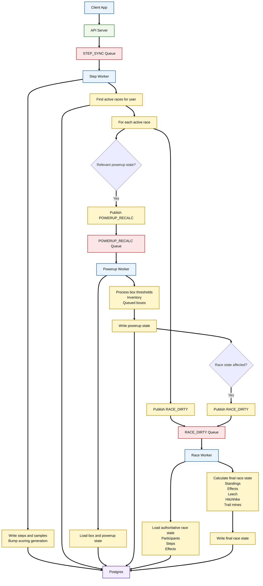

# Bara Queue-First Step / Powerup / Race Refactor

## Status

Implementation specification for branch `performance/scalability`.

This document defines the queue-first refactor for the step-sync, powerup-state, and race-resolution pipeline. It is intentionally scoped to the smallest architecture that gives Bara durable queue-first intake and independently scalable workers without introducing Kafka, a second Redis deployment, feature flags, a rollback framework, or a dead-letter subsystem.

The existing Redis/Valkey instance is used for all three Streams.

---

# 1. Goals

The refactor has five goals:

1. Remove the expensive step-sync database transaction from the HTTP request path.
2. Use Redis Streams as the durable work transport for step sync, powerup recalculation, and race resolution.
3. Keep Postgres as the authoritative source of truth for game state.
4. Preserve the existing scoring and powerup behavior. This is an orchestration refactor, not a gameplay rewrite.
5. Keep each Postgres transaction short and give each worker one clear ownership boundary.

Non-goals:

- Do not introduce Kafka.
- Do not create a second/shared Redis deployment as part of this branch.
- Do not add feature flags or a parallel legacy/new-path router.
- Do not redesign notifications, billing, ranked, or unrelated cron jobs.
- Do not change scoring formulas, powerup semantics, mystery-box odds, race settlement rules, or notification copy.
- Do not make Redis the source of truth for final steps or race state.
- Do not build a generalized queue framework for every job in the application.
- Do not add a DLQ in the first implementation. Failed messages remain pending and are reclaimable.
- Do not remove existing post-resolution tasks unless required to preserve correctness.

---

# 2. Target architecture



The API only publishes `STEP_SYNC`.

The Step Worker publishes `RACE_DIRTY` for every affected active race. It additionally publishes `POWERUP_RECALC` when that race/user needs box or powerup-state processing.

The Powerup Worker can publish another `RACE_DIRTY` after it changes powerup-specific state.

The Race Worker remains the only authoritative writer of final race totals and standings.

---

# 3. Ownership rules

These ownership boundaries are hard requirements.

## 3.1 API Server

Owns:

- authentication
- request-size validation
- idempotency-key format validation
- step-sync payload canonicalization/validation needed to reject malformed input
- durable `XADD` into `STEP_SYNC`
- returning an accepted response after Redis confirms the message exists

Does not own:

- Postgres step writes
- race discovery
- race resolution
- box/mystery-box updates
- scoring calculations

## 3.2 Step Worker

Owns:

- canonical daily step write
- five-minute sample persistence/reconciliation
- per-user scoring-input generation/watermark
- step-sync idempotency finalization
- `last_step_sync_at`
- active-race discovery after the authoritative step commit
- publishing downstream `RACE_DIRTY` and optional `POWERUP_RECALC`

Does not own:

- final race totals
- final race placement/standings
- timed effect math
- leech/hitchhike/trail-mine scoring
- final powerup-effect scoring

## 3.3 Powerup Worker

Owns powerup-specific state currently represented by `syncRacePowerupState()`, including:

- box eligibility threshold checks
- `nextBoxAtSteps`
- box gate repair
- mystery-box earning/rolling
- queued box promotion
- occupied/open slot handling
- inventory state needed by the box pipeline
- related powerup-slot cache invalidation

It does not own final race totals or standings.

Timed effect scoring remains in the Race Worker.

## 3.4 Race Worker

Owns the current authoritative race-resolution engine:

- race state loading
- scoring prefetch
- participant scoring
- active effect application
- rainstorm/wrong-turn/buff/debuff calculations
- leech transfers
- hitchhike copies
- trail-mine consequences
- global-event multipliers
- final `race_participants.total_steps`
- final `raw_steps`
- effect-resolution writes produced by the scoring engine
- race impact events
- placement/standings inputs
- existing post-resolution handoff

No other worker writes final race totals.

---

# 4. Redis Streams

Create one small module dedicated to critical queue operations. Do not put these methods into the existing cache-fallback semantics without changing their contract.

The current `src/shared/cache/redisCache.js` explicitly treats Redis as optional cache infrastructure: Redis errors are swallowed and callers fall back to Postgres. That contract is correct for caches and wakeups, but it is wrong for queue-first step intake.

Once the API acknowledges a step sync based on Redis, failure to publish must be visible to the caller.

Create:

`src/shared/queues/redisStreams.js`

It may use the same `REDIS_URL` and `CACHE_ENV_PREFIX`, but its API must be strict.

Required behavior:

- Redis disabled/unreachable on a required publish => throw
- `XADD` failure => throw
- consumer read failure => worker logs and retries connection/read loop
- ACK failure => leave message pending and retry/reclaim later
- namespace all stream/group keys with the environment prefix
- no silent Postgres fallback

## 4.1 Stream names

Logical names:

- `step-sync`
- `powerup-recalc`
- `race-dirty`

Physical names use the existing environment prefix:

- `${CACHE_ENV_PREFIX}queue:step-sync:v1`
- `${CACHE_ENV_PREFIX}queue:powerup-recalc:v1`
- `${CACHE_ENV_PREFIX}queue:race-dirty:v1`

## 4.2 Consumer groups

- `step-workers-v1`
- `powerup-workers-v1`
- `race-workers-v1`

Consumer identity:

`${hostname-or-instance}:${process.pid}`

The helper should create a group with `MKSTREAM` when absent and tolerate `BUSYGROUP`.

## 4.3 Required helper surface

Keep the helper intentionally small:

- `publish(stream, fields)`
- `ensureGroup(stream, group)`
- `readGroup({ stream, group, consumer, count, blockMs })`
- `ack(stream, group, messageId)`
- `reclaimIdle({ stream, group, consumer, minIdleMs, count })`
- `pendingSummary(stream, group)`

Do not build a generic framework beyond these operations.

---

# 5. Queue message contracts

All messages must be small, versioned, and contain identifiers/work context rather than copies of authoritative race state.

Queue payloads are work instructions. Postgres remains game-state truth.

## 5.1 STEP_SYNC v1

Stream: `queue:step-sync:v1`

Fields:

```json
{
  "schemaVersion": 1,
  "syncId": "<uuid>",
  "userId": "<user id>",
  "idempotencyKey": "<existing client idempotency key>",
  "timeZone": "America/New_York",
  "homePull": false,
  "requestHash": "<canonical request hash>",
  "dailyDate": "2026-09-18",
  "dailySteps": 10432,
  "samplesJson": "[...]",
  "requestedAt": "2026-09-18T14:30:00.000Z"
}
```

Use Redis Stream fields rather than one opaque application object if convenient, but `samplesJson` may remain JSON because the samples are naturally a collection.

The HTTP layer should run the same canonicalization and sample validation needed to reject invalid requests before enqueue.

The worker must validate the schema again before using the payload.

## 5.2 POWERUP_RECALC v1

```json
{
  "schemaVersion": 1,
  "userId": "U123",
  "raceId": "R55",
  "participantId": "P77",
  "sourceGeneration": "482",
  "requestedAt": "2026-09-18T14:30:00.100Z"
}
```

This queue means: canonical step input changed and the user's box/powerup-specific state in this race may now need processing.

Do not put final total steps or effect-derived score into this payload.

## 5.3 RACE_DIRTY v1

```json
{
  "schemaVersion": 1,
  "raceId": "R55",
  "userId": "U123",
  "sourceGeneration": "482",
  "reason": "STEP_INPUT_CHANGED",
  "requestedAt": "2026-09-18T14:30:00.100Z"
}
```

Allowed first-version reasons:

- `STEP_INPUT_CHANGED`
- `POWERUP_STATE_CHANGED`

The schema should be extensible so existing non-step race dirty reasons can migrate later, but this branch should not rewrite every producer unless required for the step pipeline.

---

# 6. HTTP step-sync refactor

Current relevant files:

- `src/modules/steps/routes/steps.js`
- `src/modules/steps/commands/recordStepSyncV2.js`
- `src/modules/steps/stepSyncCanonical.js`

Current behavior performs a Postgres transaction in the request path and returns a committed step record plus queued race-resolution metadata.

New behavior:

1. authenticate
2. preserve the 64 KiB sync-v2 request cap
3. validate idempotency-key format
4. canonicalize body using existing canonicalization logic
5. normalize/remove overlapping samples
6. create `syncId`
7. publish one `STEP_SYNC` message
8. return HTTP 202 after `XADD` succeeds

If Redis publish fails, return 503. Do not report success.

The API must not write steps to Postgres.

## 6.1 Response contract

The client currently expects fields derived from committed storage. Update the backend response to an explicit accepted state.

Recommended response:

```json
{
  "state": "QUEUED",
  "syncId": "<uuid>",
  "acceptedAt": "<timestamp>",
  "stepIntakeSemantics": "QUEUE_FIRST_V1"
}
```

If current Flutter code requires fields like `record` or `raceResolution`, either update the frontend in the same release or return a compatibility shape whose values clearly indicate queued/pending. Do not fabricate committed database values.

Before implementing the response, search the frontend for consumers of:

- `stepIntakeSemantics`
- `raceResolution`
- `uploaderReconciliation`
- `sampleCount`
- sync-v2 `record`

Update those call sites together.

---

# 7. Step Worker

Create:

`src/modules/steps/jobs/stepSyncStreamWorker.js`

The worker is a long-running consumer of `STEP_SYNC`.

## 7.1 Worker loop

Simple first version:

1. ensure consumer group
2. reclaim messages idle for at least 30 seconds, bounded batch
3. read new messages with `XREADGROUP`
4. process with bounded concurrency
5. ACK only after processing is fully safe
6. repeat

Start with conservative concurrency, for example 2 to 4 concurrent step messages per process. Measure before increasing.

Redis absorbs bursts; worker concurrency protects Postgres.

## 7.2 Processing before Postgres transaction

Do not open a DB transaction when the message is first claimed.

Before `BEGIN`:

- decode message
- validate schema
- reconstruct/canonicalize request
- normalize sample shape
- remove overlaps
- compute any pure in-memory structures
- reject permanently malformed queue payloads with a logged terminal handling decision. Because there is no DLQ in this version, malformed internal messages should be loudly logged and ACKed only when the error is proven non-retryable.

## 7.3 Short authoritative transaction

Refactor `stepInputIntake` so its source-persistence portion can run without active-race discovery or race-resolution-job creation.

Recommended new service seam:

`src/modules/steps/services/persistStepInput.js`

Move/reuse these current responsibilities:

- `lockScoringInputState(tx, userId)`
- Home cooldown update when `homePull`
- `upsertDailyStep`
- `StepSample.reconcileBatchOn`
- `readSampleInputBounds`
- scoring-change classification
- resulting generation
- `persistScoringInputState`
- `last_step_sync_at`
- StepSyncRequest reservation/finalization/idempotency

The transaction must not:

- load active races
- create `RaceResolutionJobV2` rows
- run race scoring
- run `syncRacePowerupState`
- perform historical discovery if it can safely be deferred

## 7.4 Idempotency

Reuse the existing `StepSyncRequest` identity where practical.

Required behavior for duplicate stream delivery:

- same `userId + idempotencyKey + requestHash`, already complete => do not persist source steps again
- same key with a different hash => terminal conflict/error, never mutate source
- processing lease expired => safe recovery
- a worker crash after Postgres commit but before Redis ACK must not duplicate step writes

The existing reservation/finalization logic in `recordStepSyncV2.js` is the starting point. Move worker-specific ownership there or into a small service rather than deleting the proven idempotency model.

## 7.5 After commit: active race discovery

After the short source transaction commits:

Query the user's active accepted races.

The current query in `stepInputIntake.js` already has the right minimal shape:

```sql
SELECT race.id AS "raceId",
       participant.id AS "participantId",
       race.max_participants AS "maxParticipants"
FROM races race
JOIN race_participants participant ON participant.race_id=race.id
WHERE race.status='active'
  AND participant.user_id=$1
  AND participant.status='accepted'
ORDER BY race.id
```

This query moves out of the step transaction.

For each returned race:

1. publish `RACE_DIRTY` unconditionally
2. decide whether `POWERUP_RECALC` is needed
3. publish it when needed

## 7.6 Determining whether POWERUP_RECALC is needed

Keep this simple.

The Powerup Worker is primarily for box/inventory state represented by `syncRacePowerupState`.

A race needs `POWERUP_RECALC` when:

- race has powerups enabled
- participant is accepted and not forfeited
- the race has a positive `powerupStepInterval`

If these fields are not in the active-race discovery query, extend the query to include them rather than performing one extra query per race.

Do not query all active effect rows merely to decide whether to enqueue this worker. Timed effect scoring is the Race Worker's responsibility.

## 7.7 Downstream publish ordering and STEP_SYNC ACK

For every active race, publish `RACE_DIRTY`.

For relevant races, publish `POWERUP_RECALC`.

Only ACK the `STEP_SYNC` message after:

- authoritative Postgres step transaction succeeded
- required downstream queue publishes succeeded

If the process crashes after the source commit and before downstream publishes/ACK, Redis will redeliver the STEP_SYNC message. Idempotency will recognize the already-committed source write, and the worker must repeat downstream discovery/publishing safely.

Duplicate downstream messages are expected and must be harmless.

---

# 8. Historical reconciliation

Current `stepInputIntake.js` performs:

- historical race discovery
- historical reconciliation intent admission
- historical discovery cursor updates

Do not delete this correctness path.

For the first implementation, move it out of the short source transaction and execute it after commit from the Step Worker, using the source envelope/generation produced by source persistence.

Existing components to preserve:

- `buildHistoricalRaceDiscovery`
- `HistoricalRaceReconciliationIntent`
- `HistoricalRaceDiscoveryCursor`

If historical discovery fails after source commit, leave the STEP_SYNC unacked so the message is retried. Existing intent admission must remain idempotent.

Do not redesign historical reconciliation into a fourth Redis Stream in this branch.

---

# 9. Powerup Worker

Create:

`src/modules/powerups/jobs/powerupRecalcStreamWorker.js`

It consumes `POWERUP_RECALC`.

## 9.1 Primary existing service

Reuse:

`src/modules/races/services/racePowerupStateSync.js`

Specifically preserve behavior around:

- active-race/powerup-enabled guard
- accepted participant guard
- raw/effective box progress
- `nextBoxAtSteps`
- malformed/unarmed gate repair
- `maxBonusSteps`
- `rollPowerup`
- queued box promotion
- slot occupancy
- `slotsChanged`

Do not copy this logic into the worker. The worker orchestrates it.

## 9.2 Getting boxEffectiveSteps

`syncRacePowerupState` rolls new boxes only when `boxEffectiveSteps` is provided.

The existing race-resolution engine already computes box-effective steps while resolving authoritative scoring.

The new Powerup Worker needs the same raw box-progress semantics without becoming a second final-scoring writer.

Implementation requirement:

- reuse the existing read-only scoring helper or extract the minimum read-only box-progress calculation from the existing scoring path
- never persist final participant totals in the Powerup Worker
- do not fork multiplier/effect math into a new independent implementation

If `computeRaceState(...)` is used to obtain `boxEffectiveStepsByUser`, ensure its writes remain captured/discarded exactly as the current read-only contract promises.

Then call `syncRacePowerupState` with the authoritative user/race context and calculated box-effective steps.

## 9.3 Powerup transaction

Keep powerup mutation transaction scope as small as possible.

The worker may write:

- `nextBoxAtSteps`
- `maxBonusSteps`
- new mystery boxes
- queued/promoted inventory state
- associated powerup events required by existing logic

It must not write:

- final `race_participants.total_steps`
- final standings

## 9.4 Publishing RACE_DIRTY

If powerup processing changes race-relevant state, publish:

`RACE_DIRTY reason=POWERUP_STATE_CHANGED`

Examples:

- a box roll or event creates state the race-resolution engine must observe
- a gate/inventory transition changes race-dependent presentation/state

If the operation is a pure inventory promotion with no race-score consequence, the worker may ACK without an additional race dirty event.

Keep this decision explicit in the result returned by the powerup processing service. Prefer returning a small `raceStateChanged` boolean rather than making the worker infer from database state.

ACK `POWERUP_RECALC` only after its Postgres mutations and any required `RACE_DIRTY` publish succeed.

---

# 10. Race Worker

Refactor the current:

`src/modules/races/jobs/raceResolutionQueueV2.js`

into a Redis Stream consumer plus reusable resolution core.

Do not rewrite the scoring engine.

## 10.1 Split queue transport from resolution core

Current `raceResolutionQueueV2.js` mixes:

- Postgres queue claiming
- leases
- retries
- lag monitoring
- Postgres wake coordination
- resolution planning
- scoring
- fenced writes
- placement handoff
- post-task handoff

Extract a callable core, for example:

`src/modules/races/services/processRaceDirty.js`

Input:

```js
{
  raceId,
  userId,
  sourceGeneration,
  reason,
  requestedAt
}
```

The core performs the existing authoritative resolution work but does not claim a `RaceResolutionJobV2` row.

Create:

`src/modules/races/jobs/raceDirtyStreamWorker.js`

The stream worker handles Redis claim/reclaim/ACK and calls `processRaceDirty`.

## 10.2 Existing scoring components to preserve

Continue using:

- `buildResolveRaceState`
- `computeRaceState`
- `createWriteCapture`
- `raceStateResolution.js`
- `effectiveStepScoring.js`
- `effectMultiplier.js`
- `raceScoringPrefetch.js`
- leech transfer logic
- hitchhike copy logic
- trail-mine logic
- active impact capture
- global event logic
- current race write fence

No scoring formula should move into Redis payloads.

## 10.3 Keep the race write fence

Redis consumer groups prevent normal duplicate concurrent consumption, but retries, multiple dirty messages, and process failures can still overlap.

Preserve the existing race-level fenced-write guarantee.

The Race Worker must remain the only writer for final race totals and should continue to acquire the existing race write fence before authoritative participant writes.

## 10.4 Generation/staleness

Do not rely on Redis message order for correctness.

For a `RACE_DIRTY` message, compare the source generation against authoritative current scoring generation/fence state.

If the message is stale and newer authoritative state has already been resolved, ACK it without rewriting older results.

If newer work arrives while a race is processing, the later message remains in the stream and will cause another pass if required.

Keep generation semantics from the current queue where they express source freshness. Remove generation fields that existed only to manage the Postgres queue row lifecycle.

## 10.5 Existing post-resolution tasks

Keep:

- `raceResolutionPostTaskHandoff`
- `raceResolutionPostTaskRunner`
- `raceResolutionDeliveryIntents`
- race progress snapshot publication
- notifications/nudges currently produced by race resolution
- placement handoff where still required

This branch is not a post-task redesign.

The Race Worker should commit authoritative race state and preserve the same downstream observable behavior.

ACK `RACE_DIRTY` after authoritative commit and required durable post-task handoff are safe.

---

# 11. What happens to RaceResolutionJobV2

Do not delete the table/model at the start of implementation.

First isolate every dependency on:

- `RaceResolutionJobV2.enqueue`
- `enqueueMany`
- job claim
- job success/failure
- job generation
- queue status APIs
- admin/system-health metrics
- tests
- frontend status responses

Then migrate the step-triggered path to Redis Streams.

Once no production producer/consumer depends on the Postgres job queue for this path, remove or retire the relevant model/table in a separate cleanup commit if safe.

If other non-step producers still use `enqueueRaceResolution`, either:

A. adapt `enqueueRaceResolution` to publish `RACE_DIRTY` so all producers converge on the new transport, or
B. leave non-step producers temporarily on the existing queue only if there is no duplicate-writer risk.

Preferred final state for this refactor: `enqueueRaceResolution` becomes the common Redis `RACE_DIRTY` publisher for all current call sites, so powerup-use/race-change producers do not keep a second active race-resolution queue.

Before implementation, grep all calls to:

- `enqueueRaceResolution`
- `enqueueRaceResolutionForUser`
- `RaceResolutionJobV2.enqueue`
- `RaceResolutionJobV2.enqueueMany`

Create an explicit migration checklist for every caller.

---

# 12. Non-step race-change producers

The architecture must still handle current producers such as:

- powerup use
- join/leave/forfeit
- race start/edit/cancel
- effect boundaries
- global event boundaries
- display/convergence refreshes
- admin repair paths

Do not leave two authoritative race workers active.

Adapt the shared `enqueueRaceResolution` service to publish `RACE_DIRTY` messages with the same semantic reason envelope.

Where a producer is inside a Postgres transaction and the publish cannot safely happen until after commit, use the existing `deferUntilAfterCommit` mechanism.

For these non-step producers, direct publish after commit is acceptable because the authoritative mutation itself remains in Postgres and existing periodic/convergence paths can still detect stale race state. However, all required publishers must throw/log appropriately rather than silently treating a failed queue publish as success.

Do not reuse `redisCache.publishDurableQueueWakeup` as the work item. Publish the actual `RACE_DIRTY` Stream message.

---

# 13. ACK and retry semantics

No DLQ in v1.

Each consumer follows the same simple rule:

1. claim/read message
2. process
3. ACK only when processing and required downstream handoff succeeded
4. on retryable error, do not ACK
5. periodically reclaim messages idle for 30 seconds or longer

Start reclaim with a small bounded count, for example 25.

A crashed worker therefore does not require the user to step-sync again.

## 13.1 Crash cases

### Worker crashes before Postgres transaction

No DB mutation. Message remains pending and is retried.

### Worker crashes during Postgres transaction

Postgres rolls back. Message remains pending and is retried.

### Step Worker crashes after Postgres commit but before downstream publishes

Message remains pending. Retry sees completed idempotency reservation, skips duplicate source write, repeats downstream discovery/publishing.

### Step Worker publishes downstream work then crashes before STEP_SYNC ACK

STEP_SYNC retries and may publish duplicate downstream messages.

Duplicates are expected.

Powerup and race consumers must be idempotent/generation-safe.

### Race Worker commits then crashes before ACK

`RACE_DIRTY` retries.

Race write fence + generation/state checks must make the replay safe.

Existing idempotent impact/post-task mechanisms must remain intact.

---

# 14. Duplicate and ordering behavior

Do not attempt strict global ordering.

Two step messages for the same user may be assigned to different consumers.

Correctness comes from:

- existing per-user scoring-state lock
- existing StepSyncRequest idempotency
- scoring generation
- authoritative Postgres state
- race write fence
- stale-generation checks

If sync B reaches its Postgres transaction before sync A, the current canonical/idempotent input rules must prevent older input from incorrectly overwriting newer state. Add explicit tests for this.

If necessary, add a small per-user Redis lock only if existing Postgres scoring serialization proves insufficient in tests. Do not add it preemptively.

---

# 15. Stream trimming

Streams must not grow forever.

Use approximate trimming on publish:

- `MAXLEN ~` with a generous first-version cap

Start conservatively based on current traffic, for example:

- STEP_SYNC: 100,000 entries
- POWERUP_RECALC: 100,000 entries
- RACE_DIRTY: 200,000 entries

Before finalizing these numbers, ensure trimming cannot delete messages still required by the active consumer group. Redis Stream trimming and pending-entry behavior must be tested on the deployed Redis/Valkey version.

If that safety cannot be guaranteed with the chosen strategy, do not trim aggressively; schedule a separate maintenance trim only after acknowledged IDs are safely behind all group pending entries.

At 1,500 users, memory pressure is not the primary constraint. Prefer correctness.

---

# 16. Worker process placement

No new DigitalOcean topology is required for this refactor.

Use the current Redis instance.

The code should nevertheless make workers independently startable so future horizontal scaling is easy.

Recommended process roles:

- current HTTP process starts API only
- resolution/background process can start Step Worker, Powerup Worker, and Race Worker initially
- later droplets can run additional consumers using the same groups without code changes

Do not bind correctness to one process or one machine.

Update `src/index.js` so:

- HTTP role does not consume Streams
- background/resolution role starts the three workers
- graceful shutdown stops blocking reads and waits briefly for in-flight handlers

Keep the implementation minimal; do not add a new service-discovery layer.

---

# 17. Frontend implications

Search the Flutter frontend before backend response changes are committed.

Relevant likely areas:

- step sync service/API model
- home refresh
- race refresh behavior
- any code waiting on `raceResolution.state`
- sync-v2 tests

New semantics:

HTTP success means **queued**, not **Postgres committed**.

The UI must not assume that immediately following the 202 response with a read will return the new step total.

Existing race refresh/eventual convergence behavior should cover the short delay. If the client currently blocks until a committed response, replace that with queued/refresh behavior.

Do not add client polling loops at high frequency.

---

# 18. File-by-file plan

## New files

### `src/shared/queues/redisStreams.js`
Strict Redis Stream helper.

### `src/modules/steps/jobs/stepSyncStreamWorker.js`
STEP_SYNC consumer.

### `src/modules/steps/services/persistStepInput.js`
Refactored source-only persistence seam extracted from `stepInputIntake`.

### `src/modules/powerups/jobs/powerupRecalcStreamWorker.js`
POWERUP_RECALC consumer.

### `src/modules/races/jobs/raceDirtyStreamWorker.js`
RACE_DIRTY consumer.

### `src/modules/races/services/processRaceDirty.js`
Reusable authoritative resolution core extracted from `raceResolutionQueueV2`.

Potential small shared schema file:

### `src/shared/queues/workMessages.js`
Only if message parsing/validation would otherwise be duplicated. Keep it tiny.

## Modify

### `src/modules/steps/routes/steps.js`
- sync-v2 route publishes STEP_SYNC
- return 202
- preserve auth/body/admission safety as appropriate
- remove direct call to DB-heavy `recordStepSyncV2` from queue-first endpoint

### `src/modules/steps/commands/recordStepSyncV2.js`
Refactor proven canonicalization/idempotency logic into callable worker services. This file may become the queue publisher command or be retired after responsibilities move.

### `src/modules/steps/services/stepInputIntake.js`
Remove/move:
- active-race query
- `RaceResolutionJobV2.enqueueMany`
- queue dirty-envelope persistence
- in-transaction historical discovery if moved after commit

Retain/reuse source-write logic through `persistStepInput`.

### `src/modules/races/services/enqueueRaceResolution.js`
Change transport from Postgres job enqueue + Redis wakeup to Redis `RACE_DIRTY` publish, preserving existing reason normalization and after-commit behavior where needed.

### `src/modules/races/jobs/raceResolutionQueueV2.js`
Extract resolution core. Remove/retire Postgres job claim/poll lifecycle from the active path.

### `src/modules/races/services/racePowerupStateSync.js`
Prefer no behavioral rewrite. Add a clear result field such as `raceStateChanged` only if needed for worker routing.

### `src/index.js`
Start/stop Stream consumers under the appropriate process role.

### `src/shared/cache/redisCache.js`
Do not change cache failure semantics. At most expose a safe way to construct/reuse underlying connection configuration if needed. Prefer keeping critical Stream code separate.

### Frontend sync-v2 service/model files
Update response semantics to QUEUED/202.

---

# 19. Existing code explicitly preserved

The refactor must preserve behavior in:

- `scoringInputVersion.js`
- `StepSample.reconcileBatchOn`
- `raceStateResolution.js`
- `computeRaceState.js`
- `effectiveStepScoring.js`
- `effectMultiplier.js`
- `raceScoringPrefetch.js`
- `racePowerupStateSync.js`
- leech logic
- hitchhike logic
- trail-mine logic
- global-step-event scoring
- race write fence
- post-task handoff
- notification intent production
- mystery-box odds/inventory semantics

If implementation requires changing one of these algorithms rather than its orchestration, stop and document why before proceeding.

---

# 20. Test plan

Tests are required before replacing the current production path.

## 20.1 Redis Stream helper tests

Test:

- publish success
- publish throws when Redis unavailable
- group creation
- read group
- ACK
- unacked pending entry
- reclaim after idle timeout
- no reclaim before timeout
- environment prefix isolation

Use a real disposable Redis/Valkey integration instance where existing test infrastructure permits. Mock-only tests are not sufficient for consumer-group semantics.

## 20.2 Step API tests

- valid sync returns 202
- response says QUEUED
- malformed payload rejected before queue
- invalid idempotency key rejected
- Redis unavailable returns 503
- API performs no Postgres step write
- API publishes exactly one STEP_SYNC per accepted request

## 20.3 Step Worker tests

- writes daily steps
- writes/reconciles samples
- bumps generation exactly as before
- no scoring change preserves generation
- duplicate message does not duplicate source writes
- conflicting idempotency hash rejected
- active race receives RACE_DIRTY
- every active race receives RACE_DIRTY
- no active race => no RACE_DIRTY
- eligible powerup race receives POWERUP_RECALC
- non-powerup race does not
- downstream publish failure leaves STEP_SYNC unacked
- crash-after-commit replay republishes downstream work safely
- historical sample correction still creates reconciliation intents

## 20.4 Powerup Worker tests

Reuse existing racePowerupStateSync behavior fixtures.

Add:

- no powerups => no mutation
- box threshold crossing creates expected box state
- queued box promotion unchanged
- duplicate POWERUP_RECALC safe
- required RACE_DIRTY published on race-relevant change
- no required RACE_DIRTY => ACK directly
- publish failure => no ACK

## 20.5 Race Worker parity

This is the most important suite.

For identical fixtures, compare old RaceResolutionWorkerV2 result versus new `processRaceDirty` result.

Exact durable parity for:

- normal step-only race
- Runner's High
- Wrong Turn
- Leg Cramp
- Rainstorm
- Leech
- Hitchhike
- Umbrella interactions
- Trail Mine
- team race
- finished/forfeited participant
- global step event
- bonus steps
- mystery-box consequence interactions
- placement changes
- race completion boundary where applicable

Compare:

- participant totals
- raw steps
- bonus steps
- effect states
- impact events
- box/powerup side effects
- placement transition handoff
- post-task creation/intents

## 20.6 Concurrency tests

- two STEP_SYNC messages for same user
- duplicate STEP_SYNC delivery
- two RACE_DIRTY messages same race
- RACE_DIRTY arrives while same race is processing
- Powerup Worker publishes RACE_DIRTY while an earlier race message is pending
- worker crash before ACK
- worker crash after DB commit before ACK
- Redis reconnect
- graceful process shutdown during blocked read

## 20.7 Load test

Compare current main versus queue-first candidate.

Burst profiles:

- 25 concurrent step syncs
- 100
- 250
- 500
- 1,000

Measure:

HTTP:
- response p50/p95/p99
- 5xx/503
- queue publish latency

Redis:
- stream depth
- pending count
- oldest pending age
- processed/sec

Postgres:
- CPU
- connection utilization
- transaction latency
- query count per committed sync
- lock waits

Workers:
- messages/sec
- processing duration
- retries/reclaims

Correctness:
- final step parity
- final race-total parity
- final powerup-state parity

Success is not merely lower HTTP latency. The goal is that burst traffic is absorbed by Redis and Postgres workload is bounded by worker concurrency.

---

# 21. Implementation sequence

Implement in this order even though the change ships as one coordinated architecture migration.

## Step 1: strict Redis Streams helper

Build and test `redisStreams.js`.

Do not touch gameplay.

## Step 2: message schemas

Create constants/parsers for the three v1 messages.

Reject unknown schema versions.

## Step 3: extract source-only step persistence

Split current `stepInputIntake` so source writes can run without race enqueue.

Prove persistence parity with existing tests.

## Step 4: implement Step Worker

Consume synthetic STEP_SYNC messages and prove DB parity.

Do not switch HTTP yet.

## Step 5: implement RACE_DIRTY publisher and race core

Extract `processRaceDirty` from current RaceResolutionWorkerV2 while retaining scoring behavior.

Build the Redis consumer.

Run full race-resolution parity suite.

## Step 6: adapt all authoritative race-resolution producers

Migrate `enqueueRaceResolution` call sites to RACE_DIRTY so there is one race-resolution transport.

Do not leave competing final race writers.

## Step 7: implement Powerup Worker

Wrap existing `syncRacePowerupState`.

Add RACE_DIRTY publication when required.

## Step 8: connect Step Worker downstream

After commit:
- discover active races
- publish RACE_DIRTY for all
- publish POWERUP_RECALC where relevant
- historical reconciliation
- ACK STEP_SYNC

## Step 9: switch HTTP endpoint

The sync-v2 API now publishes STEP_SYNC and returns 202.

Update Flutter contract in the same release.

## Step 10: process startup/shutdown

Start all three consumers under background/resolution process role.

Ensure graceful shutdown.

## Step 11: remove active Postgres queue path

Once tests prove no producer uses the old race-resolution queue, stop scheduling its claim loop.

Do not immediately drop tables.

## Step 12: full regression and load test

No deployment until parity and queue-recovery tests pass.

---

# 22. Acceptance criteria

The refactor is complete when all of the following are true:

1. HTTP step sync performs no canonical step Postgres write.
2. Successful HTTP response means STEP_SYNC was durably accepted by Redis.
3. Redis publish failure returns an error rather than pretending success.
4. Step Worker writes the same canonical step state as current main.
5. Step Worker always emits RACE_DIRTY for every affected active race.
6. Powerup Worker handles box/inventory state without writing final race totals.
7. Race Worker is the only final race-total writer.
8. Existing scoring parity tests pass unchanged or with transport-only fixture adjustments.
9. Worker crashes before ACK lead to automatic retry without requiring another client sync.
10. Duplicate/replayed messages are safe.
11. Postgres transactions are shorter than the current step-sync transaction and no longer include active-race enqueue work.
12. Current post-resolution notifications/cache/placement behavior remains intact.
13. No Kafka, no second Redis deployment, no DLQ, no feature-flag framework added.
14. Load test demonstrates burst absorption by the Stream and bounded Postgres concurrency.
15. Documentation and Mermaid architecture match the shipped code.

---

# 23. Example end-to-end scenarios

## Scenario A: user walks 10,000 steps, no powerups

1. iPhone sends sync-v2.
2. API validates and XADDs STEP_SYNC.
3. API returns 202.
4. Step Worker writes steps/samples and generation.
5. Step Worker finds Race A.
6. Step Worker publishes RACE_DIRTY Race A.
7. Race Worker reads authoritative steps/effects.
8. Race Worker recomputes Race A.
9. Race Worker commits final totals.
10. Messages are ACKed.

No POWERUP_RECALC is required.

## Scenario B: user walks 10,000 steps in a powerup-enabled race

1-4 same as above.
5. Step Worker finds Race B with powerups enabled.
6. Step Worker publishes RACE_DIRTY Race B.
7. Step Worker also publishes POWERUP_RECALC Race B/U123.
8. Powerup Worker calculates box progress and updates inventory/box state.
9. If this changed race-relevant state, it publishes another RACE_DIRTY.
10. Race Worker processes authoritative latest DB state.
11. Duplicate race-dirty messages are safe; stale work is skipped or results in a harmless extra latest-state pass.

## Scenario C: Step Worker crashes after commit

1. STEP_SYNC is claimed.
2. Source step transaction commits.
3. Process crashes before downstream publishes/ACK.
4. Message remains pending.
5. Same or another worker reclaims it.
6. Idempotency detects source already committed.
7. Worker performs active-race discovery and downstream publishes.
8. ACK.

User does not need another sync.

## Scenario D: Race Worker crashes after final DB commit

1. RACE_DIRTY claimed.
2. Race resolution commits.
3. Process crashes before ACK.
4. Message reclaimed.
5. Fence/generation/current state prove replay safety.
6. No duplicate incorrect final state.
7. ACK.

---

# 24. Design principle

The entire refactor should remain understandable as:

```
Redis moves work.
Workers do computation.
Postgres stores truth.
```

Do not introduce another layer unless a concrete correctness or measured performance requirement demands it.
